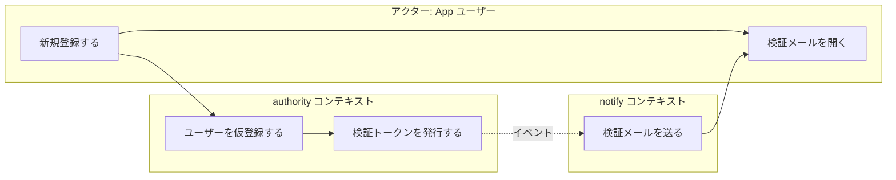
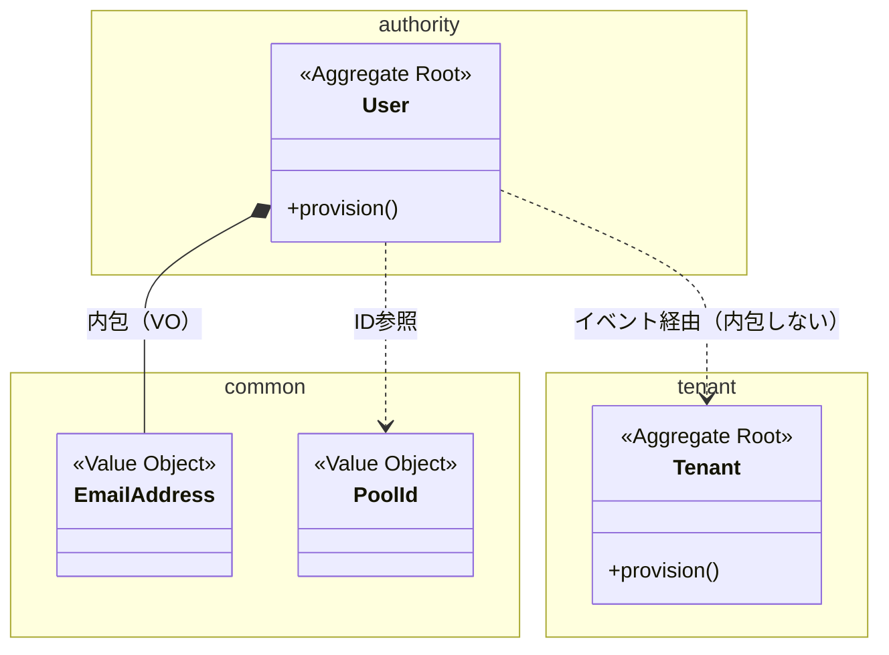
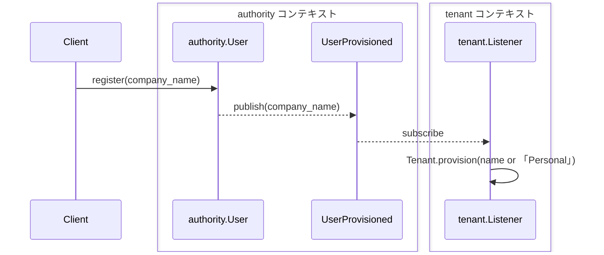

# ドメインモデル設計 (design)

実装に着手する**前に**、GitHub Issue をドメイン駆動設計(DDD)でモデリングし、**コンテキスト境界（どのクラスがどのコンテキストに属するか）・集約境界・不変条件・値オブジェクト・ドメインイベント・振る舞い**を明示した「ドメインモデル設計書」を作る。**設計書は Claude Code Web の Artifact として発行してレビュー承認を得る**（claude.ai/code の Artifact は mermaid 図もテーブルも描画するので、スマホから GitHub アプリを開かずに図付きで承認判断できる）。そして**人間のレビュー承認で必ず一度止まり、承認後に Issue の説明欄（body）へ反映する**（後続が読める永続化）。ここが `/fastmvp:refine`（design → 実装計画）→ `/fastmvp:dev` の中で最も設計品質を左右する工程。コードは 1 行も書かない（設計だけ）。

> なぜこのスキルが要るか: DDD ハンドブック（このプラグイン同梱の `rules/backend/src/domain/model/*.md`）は rules-guard フックが「対象ファイルに触れたとき」に要点を注入する方式のため、**まだコードを書いていない設計フェーズでは一度もコンテキストに入らない**。このスキルが明示的に読み込み、モデリング判断に反映させる。

## 手順

### 1. 入力を集める

```bash
ISSUE_NUMBER={引数}
gh issue view "$ISSUE_NUMBER" --json title,body,labels
```

- ユーザーストーリー / 達成条件 / 参照ドキュメントを読む。不明点は `AskUserQuestion` で確認（claude.ai/code 経由なら通知が飛ぶ）。
- Issue が大きすぎて 1 モデルに収まらないと感じたら、この段階で分割方針をメモしておく（最終的に `/fastmvp:refine` が Issue 分割する）。

### 2. DDD ハンドブックを明示的に読み込む（必須・スキップ禁止）

設計判断の基準にするため、着手前に以下を `Read` する。DDD ハンドブックは**このプラグインに同梱**されている（プロジェクトの `.claude/rules/` に同じ相対パスのルールがあればそちらを優先して読む）:

```bash
# プラグインルートの解決（rules/ はこのスキルの 2 階層上）
PLUGIN_ROOT="${CLAUDE_PLUGIN_ROOT:-$(cd "${CLAUDE_SKILL_DIR}/../.." && pwd)}"
```

- `$PLUGIN_ROOT/rules/backend/src/domain/model/domain.md`（貧血症回避）
- `$PLUGIN_ROOT/rules/backend/src/domain/model/domain_service.md`（ドメインサービス・ファクトリとしての ACL）
- `$PLUGIN_ROOT/rules/backend/src/domain/model/aggregate.md`（集約境界・不変条件・ID 参照）
- `$PLUGIN_ROOT/rules/backend/src/domain/model/value-object.md`（primitive obsession 撲滅）
- `$PLUGIN_ROOT/rules/backend/src/domain/model/domain-event.md`（プレーン/集約跨ぎ）
- `$PLUGIN_ROOT/rules/backend/src/domain/model/repository.md`（境界キー・ACL）
- `$PLUGIN_ROOT/rules/backend/src/application/application.md`（アプリケーションサービスの薄さ）
- プロジェクトの `CLAUDE.md` の用語集・境界の背景思想（あれば。設計の背景思想の正）

### 3. 既存モデルの再利用監査（新規実装を作る前に必ず）

認証・テナント等の横断機能は既存モジュールを再利用し、並行実装を作らない（プロジェクトの `CLAUDE.md` の再利用方針が正）。新しい集約を提案する前に、**既存で表現できないか**を確認する:

- 関連しそうなモジュール（例: `authority` / `tenant` / `payment` / `notify` / `billing`。実際のモジュール構成は `backend/src/` を `Glob` で確認する）の `domain/model/` を `Glob` / `Grep` で調べ、既存集約・VO・イベントを棚卸しする。
- 既存集約に**メソッドを足すだけ**で満たせるなら、新規集約を作らない。
- 別モジュールの集約が要るなら ACL（`AuthorityAdapter` 型）で読む方針にする（`$PLUGIN_ROOT/rules/backend/src/domain/model/repository.md`）。
- 規範例として最も参考になるのは `authority`（集約の充実度）と `tenant`（ACL の型）。

### 4. ドメインモデル設計書を作る

以下の節を埋める。**コードは書かず、モデルの意図と境界を日本語で記述**する（クラスのシグネチャ羅列ではなく「なぜその境界か」を書く）。

```markdown
## 🧭 ドメインモデル設計

### 図解（mermaid・レビュー用サマリ）
（レビュアーが表を読む前に「モデルの形」を掴めるよう先頭に置く。**業務フロー図・クラス図・シーケンス図の 3 枚**で、いずれもコンテキスト境界を視覚化する。下の「4.1 図解のガイド」参照）

### コンテキストマップ（クラスの所属先を最初に宣言する）
| コンテキスト（モジュール） | プレーン/DB | 本 Issue での役割 | 他コンテキストとの連携方式 |
|---|---|---|---|
| 例: authority | ルーティング側（App/Control 両面） | User に振る舞いを追加 | UserProvisioned を発行 → notify が購読 |

- 設計書に登場する**すべてのクラス（集約 / Entity / VO / イベント）は、ここに挙げたコンテキストのいずれかに属する**。以降の表・図ではクラス名を裸で書かず、常に **`コンテキスト.クラス名`**（例 `authority.User` / `common.EmailAddress`）で表記する（「どのコンテキストのクラスか」を読み手に推測させない）。
- コンテキストを跨ぐ連携は「ドメインイベント」か「ACL + ID 値オブジェクト参照」のみ（別コンテキストの集約を内包・直接 import しない）。

### 用語集（ユビキタス言語）
| 用語 | 定義 | 採用/却下理由 |
|---|---|---|
| （既存 CLAUDE.md 用語と衝突しないか確認する） | | |

### 集約
| 集約（ルート） | 内包する Entity/VO | 守る不変条件 | トランザクション境界 | 新規/既存 |
|---|---|---|---|---|
| 例: authority.User | Token, Account | リセットは PASSWORD_RESET トークンのみ | 1 User = 1 Tx | 既存に追加 |

- 各集約が「なぜその境界か（何と何が常に同時に正しくあるべきか）」を 1〜2 行で説明する。
- 他集約は ID 値オブジェクト参照（内包しない）ことを明記。

### 値オブジェクト（primitive obsession の撲滅）
| 値オブジェクト | 何をラップするか | 制約/振る舞い | 新規/既存 |
|---|---|---|---|
| 例: common.EmailAddress | メールアドレス str | 形式検証・domain 部の取得 | 既存 (common) |

- 生 str/int のまま引き回そうとしている業務概念があれば VO 化候補として挙げる。

### ドメインイベント
| イベント（過去形） | 発行契機 | 購読側/波及先 | プレーン跨ぎか |
|---|---|---|---|
| 例: authority.UserProvisioned | authority.User.provision | notify(検証メール) | いいえ |

- プレーン/集約/モジュールを跨ぐ副作用がイベントになっているか確認。

### 振る舞い（ユビキタス言語の動詞 → 集約メソッド）
| 動詞（業務語彙） | 実装先集約.メソッド | 不変条件 |
|---|---|---|
| 例: パスワードをリセットする | authority.User.reset_password | 有効な PASSWORD_RESET トークン必須 |

- ここが埋まらない/薄いと貧血ドメインになる。ユースケースの動詞を必ず集約メソッドに割り付ける。

### リポジトリ / ACL
- 追加・変更するリポジトリ IF と、境界キー（pool_id / app_id）の取り扱い。
- 別モジュール集約を読むなら ACL（Service IF + read-model + 翻訳アダプタ）の配置。

### アプリケーションサービス（薄い調整役）
- 追加するユースケースメソッド（取得系=DPO / 更新系=@transactional + Command）。
- 各メソッドが「集約メソッドを呼ぶだけ」の薄さになっているか（ロジックが漏れていないか）。

### 未解決の設計判断（レビューで決めたい点）
- 例: この整合は同期(同一集約)か結果整合(イベント)か。集約境界の代替案とトレードオフ。
```

### 4.1 図解のガイド（mermaid でレビュー負荷を下げる）

密な表だけではレビュー負荷が高い。設計書先頭の「図解」節に**業務フロー図・クラス図・シーケンス図の 3 枚**を置き、レビュアーが「業務の流れ → モデルの形 → 実行時の流れ」の順で読めるようにする。**3 枚すべてでコンテキスト境界を視覚化し、どのクラスがどのコンテキストに属するかを図から読めるようにする**（コンテキストマップの表と食い違わせない）。網羅性より「レビューで論点になる集約境界・跨ぎの副作用」を優先する。mermaid は ```mermaid フェンスのまま書く。**レビュー用の Artifact（ステップ 5）でも承認後の Issue 説明欄でも、同じフェンス記法で図として描画される**（claude.ai/code の Artifact 描画エンジンと GitHub が両方 mermaid を描画する。※ Artifact でも生 markdown をチャットに流すと描画されないので、必ず Artifact として発行する）。

**(A) 業務フロー図（flowchart）** — 「誰が・何をきっかけに・何をして・どこでコンテキスト境界を越えるか」を、アクター/コンテキストごとの swimlane（`subgraph`）で描く。レビュアーが最初に読む図なので、クラス名ではなく**業務語彙（用語集の動詞）**で書く:



**(B) クラス図（classDiagram）** — 集約 / VO / ID 参照を **`namespace`（＝コンテキスト境界）で括って** 1 枚で。内包は実線 `*--`、他集約への ID 参照は破線 `..>`。**コンテキストを跨ぐ線は ID 参照（破線）かイベント経由のみ**（跨ぐ内包 `*--` を描いた時点で境界が壊れている）。mermaid の制約により、関連は `namespace` ブロックの**外**に書く:



**(C) シーケンス図（sequenceDiagram）** — ユースケース実行時の集約・イベントの流れ。**participant を `box`（＝コンテキスト境界）で括り**、同期呼び出しは実線 `->>`、イベント伝播は破線 `-->>` で区別する（コンテキスト・プレーンを跨ぐ副作用が同期 `->>` で描かれていたら設計を疑う）:



- 業務フロー図の swimlane・クラス図の `namespace`・シーケンス図の `box` は**コンテキストマップの行と 1:1 対応**させる（図ごとに境界の切り方を変えない）。
- 「未解決の設計判断」が集約境界の選択なら、**代替案を別 mermaid で並置**すると人間の判断が速い。
- 図はモデルの意図を示す補助であり、正は表と本文（作図の体裁に凝りすぎない。1 図 10〜20 ノード程度に抑える）。

### 5. 設計書を Artifact として発行する（Claude Code Web で描画・スマホでレビュー可能に）

作った設計書を `design.md` に書き出し、**`Artifact` ツールで Artifact として発行**する（この時点では Issue に投稿しない）。claude.ai/code の Artifact 描画エンジンは **mermaid 図もテーブルも描画**するので、レビュアーはスマホの Claude アプリ内でリンクを開いて「図＋表」を描画状態で読め、GitHub アプリを開かずに承認判断できる:

- **Markdown をそのまま Artifact として発行すればよい**（描画エンジンが mermaid フェンスと表を描画するので、独自 HTML/CSS を組む必要はない）。図解は ```mermaid フェンスのまま `design.md` に置く（ステップ 4.1）。
- `design.md` 全体を**先頭の開始マーカー `<!-- domain-model-design -->` と末尾の終了マーカー `<!-- /domain-model-design -->` で挟んでおく**（HTML コメントなので Artifact 上でも Issue 上でも不可視。承認後に Issue 説明欄へ反映する際、この区間が設計書セクションを画定し、後続の発見と再実行時の置換に使う。ステップ 6.5）。
- **修正時は同じ `design.md`（同一 file path）を再発行**すれば同じ URL が維持され、レビュアーは同じリンクで最新版を見られる。

### 6. 人間のレビューで止まる（このスキルの肝）

直前に発行した Artifact（設計書）を **URL 付きで示して** `AskUserQuestion` でレビューを依頼する（スマホでもリンクを開いて図を見つつボタンで選べる）。**承認が出るまで Issue への反映も実装計画・実装も進まない**:

- 選択肢: 「承認（この設計で進む）」/「修正（指摘を反映して再提示）」/「却下（別アプローチで作り直す）」
- 「修正」なら指摘（集約境界・VO・イベントの過不足）を `design.md` に反映し、**同じ file path で Artifact を再発行**（URL 維持）して再度レビュー依頼する（Issue にはまだ反映しない＝中途版で Issue を汚さない）。
- 「未解決の設計判断」に挙げた点は、ここで人間の判断を仰いで確定する。

> 承認された設計書が、後続の実装計画（Plan エージェント）と `/fastmvp:dev`（実装）と `domain-model-reviewer`（実装後の鑑定）すべての基準になる。ここで人間が「これは VO にすべき」「集約境界が違う」を言えば、500 行書いた後の手戻りをコード前に潰せる。

### 6.5. 承認後に Issue 説明欄へ反映する（後続が発見できる永続化）

**「承認」が出たら**、（マーカーで挟んだ）`design.md` を **Issue の説明欄（body）に反映する**。Issue コメントには投稿しない（コメントは他の議論に埋もれて後続が見落とす）。後続の実装計画（Plan エージェント）/ `/fastmvp:dev` / `domain-model-reviewer` は**説明欄のマーカー区間 `<!-- domain-model-design -->` 〜 `<!-- /domain-model-design -->` を SoT として発見・突き合わせる**ため、承認された設計は必ず説明欄に残す（Artifact は後続セッションからは辿れない）。承認前・修正中は反映しない。

**元の Issue 本文（ユーザーストーリー・達成基準など）は消さない**: 説明欄の全置換ではなく、マーカー区間だけを置換する（区間が無い初回は末尾に追記）。再実行時も同じ区間を置換するので、設計書は説明欄に常に 1 つ:

```bash
BODY_FILE=$(mktemp)
gh issue view "$ISSUE_NUMBER" --json body --jq .body > "$BODY_FILE"
python3 - "$BODY_FILE" /path/to/design.md <<'PY'
import re, sys
body = open(sys.argv[1]).read()
design = open(sys.argv[2]).read().strip()
pattern = re.compile(r"<!-- domain-model-design -->.*?<!-- /domain-model-design -->", re.S)
if pattern.search(body):
    # design 内の \ を置換エスケープと解釈させないため lambda で渡す
    body = pattern.sub(lambda _: design, body, count=1)
else:
    body = body.rstrip() + "\n\n---\n\n" + design + "\n"
open(sys.argv[1], "w").write(body)
PY
gh issue edit "$ISSUE_NUMBER" --body-file "$BODY_FILE"
```

長文になるため本文の受け渡しは必ずファイル経由（`--body-file` / 一時ファイル）で行う。

### 7. 承認後の受け渡し

- 承認された設計書はステップ 6.5 で Issue 説明欄（マーカー区間）に反映されているので、呼び出し元（`/fastmvp:refine`）はそれを前提に**実装計画を立てる**（組み込みの `Plan` エージェント＝`Agent` ツールの `subagent_type: "Plan"` を起動する。`/plan` というスキルは存在しない）。
- 単体起動（`/fastmvp:design {Issue番号}` 直接）の場合は、承認済みである旨と「次に `/fastmvp:refine`（実装計画 → Issue 反映まで）に進める」ことをユーザーに伝えて終了する。

## 注意事項

- **コードを書かない**。集約/VO の実ファイルには触らない。成果物は設計書だけ（Artifact でのレビュー提示 → 承認後の Issue 説明欄反映）。
- **既存を再利用する**（`authority` / `tenant` / `payment` の並行実装を作らない）。新規集約は再利用監査で否定できたときだけ提案する。
- **承認前に進まない**。人間チェックポイントをスキップしない（このスキルの存在理由）。
- 用語集は `CLAUDE.md` の既存用語（App / User Pool / Tenant / owner_id 等）と衝突しないよう突き合わせる。
